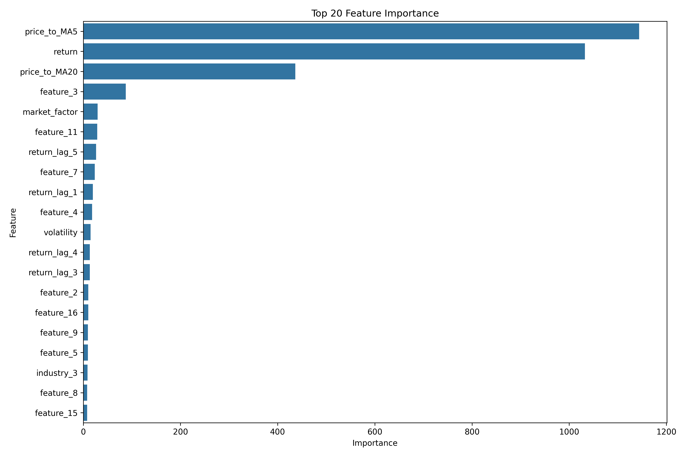
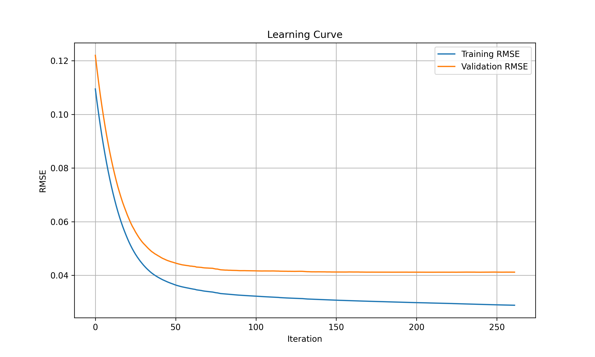
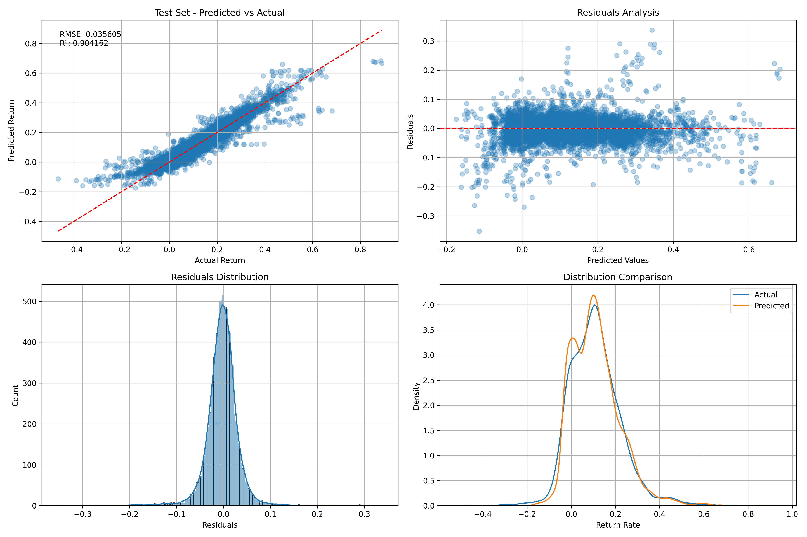

# 五日加权收益率预测模型

## 概述

基于lightGBM学习的股票收益率预测模型，通过日度级别的股票特征和行业分类预测未来5天的加权收益率

- 使用20个日度级别的股票特征
- 利用行业分类特征(dummy)捕捉行业效应
- 采用LightGBM算法构建预测模型
- 完整的数据模拟、特征工程、模型训练、评估和回测流程，提供可视化


## 代码结构

```
├── main.py            # 主函数
├── model.py           # 模型训练、评估、回测
├── process_data.py    # 数据生成和预处理功能
├── visaulize.py       # 结果可视化功能
├── utilities.py       # 辅助功能(日志记录、目录创建等)
└── requirements.txt   # 环境设置
```

## 主要功能

### 数据生成与预处理

- 生成模拟股票数据，包含20个基础特征和行业分类
- 模拟行业效应、市场因子、特征交互等真实市场特性
- 计算未来5天的加权收益率作为预测目标
- 添加技术指标增强特征集
- 支持时间序列分割和随机分割数据

### 模型训练与优化

- 使用LightGBM回归模型预测收益率
- 支持提前停止训练防止过拟合
- 保存训练过程和学习曲线

### 模型评估与回测

- 使用多种评估指标：RMSE, R², 方向准确率等
- 提供特征重要性分析
- 实现时间序列滚动窗口回测
- 详细记录每个回测窗口的性能

### 可视化与分析

- 预测结果可视化
- 残差分析
- 特征重要性可视化
- 回测性能汇总

## 使用方法

直接运行main.py即可

## 参数说明

主函数`main()`接受以下参数：

- `use_time_series_split`: 是否使用时间序列分割而非随机分割。默认为`True`。
- `run_backtest` : 是否运行时间序列回测。默认为`False`。

### 模拟生成参数

`generate_stock_data()`函数接受以下参数：

- `n_stocks` : 模拟的股票数量，默认为100。
- `n_days` : 模拟的天数，默认为500。
- `n_industries` : 行业数量，默认为10。
- `add_market_factor` : 是否添加市场因子，默认为True。
  
### LightGBM参数


```python
params = {
    'objective': 'regression',     # 回归任务
    'metric': 'rmse',              # 使用均方根误差评估
    'boosting_type': 'gbdt',       # 梯度提升决策树
    'num_leaves': 31,              # 单棵树最大叶子数
    'learning_rate': 0.05,         # 学习率
    'feature_fraction': 0.9,       # 特征抽样比例
    'bagging_fraction': 0.8,       # 数据抽样比例
    'bagging_freq': 5,             # 执行抽样的频率
    'early_stopping_round': 50,    # 提前停止训练的轮数
    'verbose': -1                  # 静默模式,不打印过多信息，可以调整为10
}
```


### 回测参数

`backtest_model()`函数接受以下参数：

- `window_size` : 训练窗口大小，默认为60。
- `step` : 窗口滑动步长，默认为20。
- `test_size` : 测试集大小，默认为20。

## 结果及分析
在全部默认的情况下，结果如下：

### 模型性能

| 指标 | 训练集 | 验证集 | 测试集 |
|------|--------|--------|--------|
| RMSE | 0.029652 | 0.041160 | 0.035605 |
| MAE | 0.020998 | 0.027563 | 0.023406 |
| R² | 0.932857 | 0.895523 | 0.904162 |
| 方向准确率 | 92.53% | 90.91% | 93.68% |

### 性能解析

1. **高解释力**：模型在测试集上达到了90.42%的R²值，表明模型捕捉了大部分股票收益率变化的模式。这在金融市场预测中是非常显著的结果。

2. **方向准确率**：测试集上的方向准确率高达93.68%，意味着模型能够准确预测股票价格走势方向（上涨或下跌）。这对于交易策略制定非常有价值。

3. **误差分析**：测试集RMSE为0.035605，考虑到股票收益率的波动性，这一误差水平是可接受的。MAE为0.023406，表明模型平均预测误差约为2.34个百分点。

4. **泛化能力**：测试集性能优于验证集，并且与训练集性能相近，表明模型没有过拟合，具有良好的泛化能力。

### 特征重要性分析






模型识别出的前4大重要特征及其重要性分值如下：

1. **价格/5日均线比率 (1143.91)**
2. **当日收益率 (1032.26)**
3. **价格/20日均线比率 (436.30)**
4. **feature_3 (87.62)**


